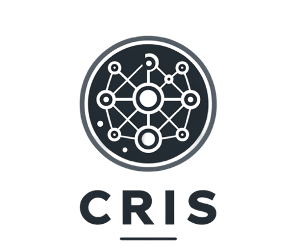

# Client Retention Intelligent System

**Overview**: This application helps businesses manage and predict customer churn.
Features include adding new customers, visualizing customer data on a map, and predicting churn probability using a pre-trained model.

**Technologies Used**:
- Streamlit for the web interface
- Folium for map rendering
- PyCaret for churn prediction model

## Installation and Running

1. Clone the repository and navigate to the directory:
    ```bash
    git clone https://github.com/juliaorteu/CRIS_interface.git
    cd CRIS_app
    ```

2. Install the required packages:
    ```bash
    pip install -r requirements.txt
    ```

3. Run the application:
    ```bash
    streamlit run app.py
    ```

4. Open your browser and go to `http://localhost:8501`.

## File Structure

- `app.py`: Main application code.
- `data/`: Customer data files.
- `best_churn_model.pkl`: Pre-trained churn prediction model.
- `logo.png`: Application logo.
- `requirements.txt`: Required Python packages.
